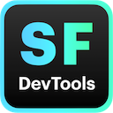

## SF DevTools – an Electron app for working with sfdx
A React UI that makes working with the sfdx cli simpler and more efficient. cli commands are executed on the main thread and the results are sent on to the React app via Electron's context bridge.

## Features
- Org management
  - see all authenticated orgs and org detail including API limits
  - for scratches: mark scratches for deletion, see expiration time
- Anonymous Apex
  - text editor for anonymous Apex with ability to bookmark frequently used scripts
  - logging output with toggle to show full logs or just debug statements
- Debugging
  - manage and create new trace flags
  - fetch log groups with pagination
  - view log items with just debug and error statements, without all the noise (or view the full log if needed)
  - delete single log groups or bulk delete logs
- Misc.
  - set the project default org (switch between your authenticated orgs)
  - dark mode and Apex editor theming
## Quick start (macOS)
### Build dmg
```bash
npm run app
```
This command will package the app and output a dmg under `./dist/`
### Run locally
```bash
npm run local
```
This will start the Electron app locally using port 3000

## Prerequisites
- `sfdx-cli` (install using e.g. homebrew, or with `npm i -g`)
- an sfdx project – you will be prompted to select the project root when you first open the app (this is where all sfdx commands will be issued from)!

## Stack
- Electron
- sfdx
- React, react-query, zustand
